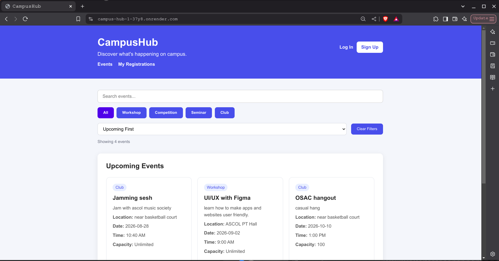
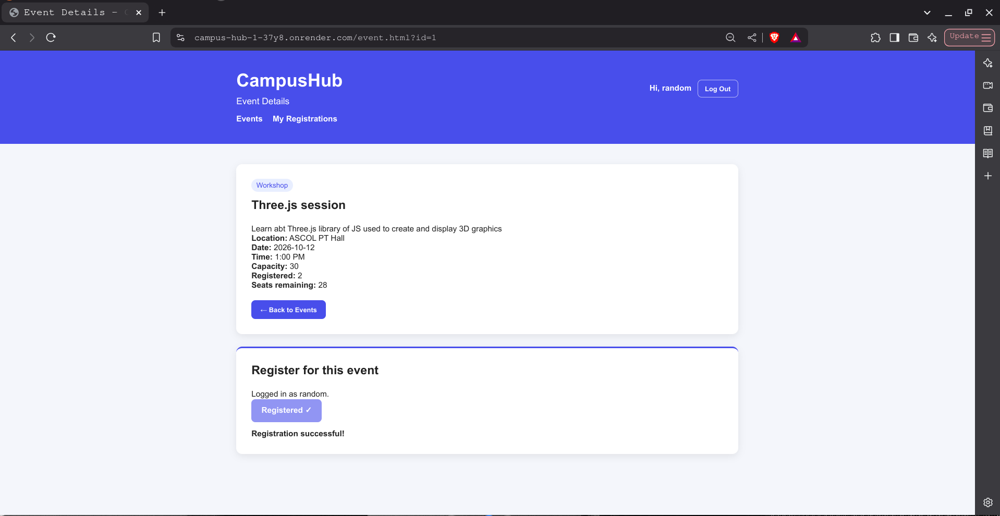
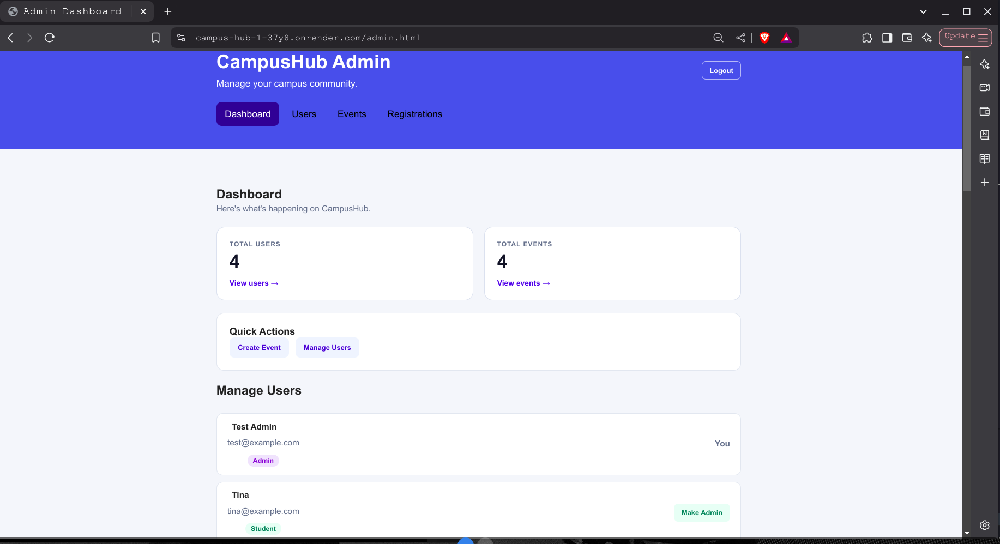
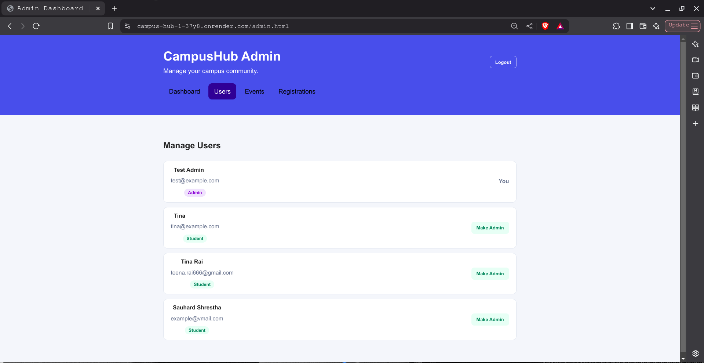
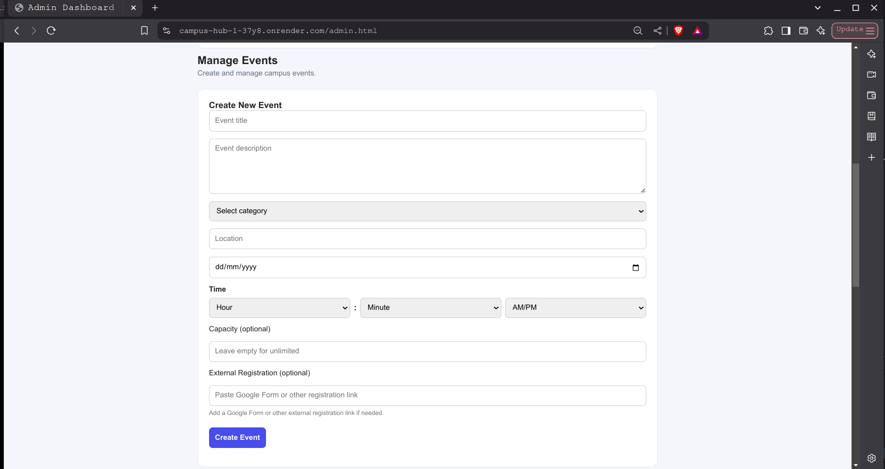
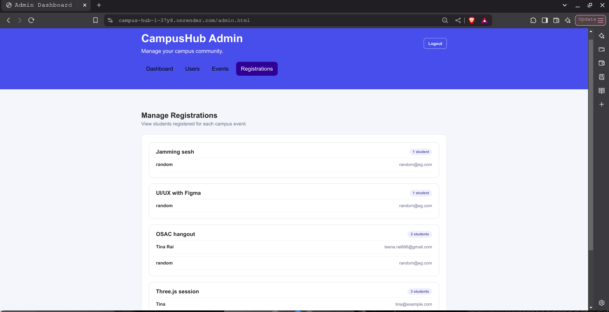

# CampusHub

A full-stack campus event management platform where students can discover and register for events, while administrators can create, manage, and monitor campus activities.

## Live Demo

[View CampusHub Live](https://campus-hub-1-37y8.onrender.com/)
## GitHub Repository

https://github.com/tina-rai/campus-hub

---
## Screenshots

### Student View





### Admin Dashboard










---
## Features

### Student Features

- Create an account and log in securely
- Browse available campus events
- Search and filter events
- View detailed event information
- Register for events
- View personal registrations
- Open an external registration form when provided by an administrator
- Log out securely

### Admin Features

- Admin authentication and role-based access
- Dashboard with user and event statistics
- Create events
- Edit events
- Delete events
- Set optional event capacity
- Create events using a 12-hour AM/PM time interface
- Add an optional external registration link
- Manage registered users
- Promote users to Admin
- Remove Admin privileges
- View and manage event registrations

### UI & UX

- Responsive layout
- Consistent typography and spacing
- Search and filtering
- Password visibility toggle
- Toast notifications
- Mobile-friendly event browsing
- Separate student and administrator experiences

---

## Tech Stack

### Frontend

- HTML5
- CSS3
- JavaScript
- Fetch API

### Backend

- Node.js
- Express.js

### Database

- PostgreSQL
- Neon

### Authentication

- Express Session
- bcryptjs
- Role-based authorization

### Deployment

- Render
- Neon PostgreSQL
- GitHub

---

## Project Structure

```text
campus-hub/
│
├── public/
│   ├── admin.html
│   ├── admin.js
│   ├── app.js
│   ├── auth.js
│   ├── event.html
│   ├── event.js
│   ├── index.html
│   ├── login.html
│   ├── my-registrations.html
│   ├── my-registrations.js
│   ├── signup.html
│   └── style.css
│
├── screenshots/
│   ├── student-dashboard.png
│   ├── event-details.png
│   ├── event-management.png
│   ├── user-management.png
│   ├── admin-dashboard.png
│   ├── view-registration-admin.png
├── server.js
├── package.json
├── package-lock.json
├── .gitignore
└── README.md
```
---


---

## How It Works

CampusHub follows a client-server architecture.

The frontend is built with HTML, CSS, and JavaScript. It communicates with the Express backend through HTTP requests using the Fetch API.

The backend handles:

- User authentication
- Session management
- Role-based authorization
- Event management
- Event registration
- User management
- Database operations

PostgreSQL is used to store users, events, and registration data.

---

## Authentication & Authorization

CampusHub uses session-based authentication.

Users can:

1. Create an account
2. Log in
3. Maintain an authenticated session
4. Access features based on their role
5. Log out

There are two main roles:

- **Student** — can browse and register for events
- **Admin** — can manage events, users, and registrations

Protected backend routes use authentication and authorization middleware to prevent unauthorized access.

---

## Database

CampusHub uses PostgreSQL hosted through Neon.

The application stores information for:

### Users

Stores user account and role information.

### Events

Stores:

- Event title
- Description
- Category
- Location
- Date
- Time
- Optional capacity
- Optional external registration link

### Registrations

Stores registration information associated with users and events.

---

## Local Development

### 1. Clone the repository

```bash
git clone https://github.com/tina-rai/campus-hub.git
cd campus-hub
```
### 2. Install dependencies
npm install

###3. Create environment variables

Create a .env file:

DATABASE_URL=your_postgresql_connection_string
SESSION_SECRET=your_session_secret
NODE_ENV=development

Do not commit your .env file.

### 4. Start the application
node server.js

Then open:

http://localhost:3000
